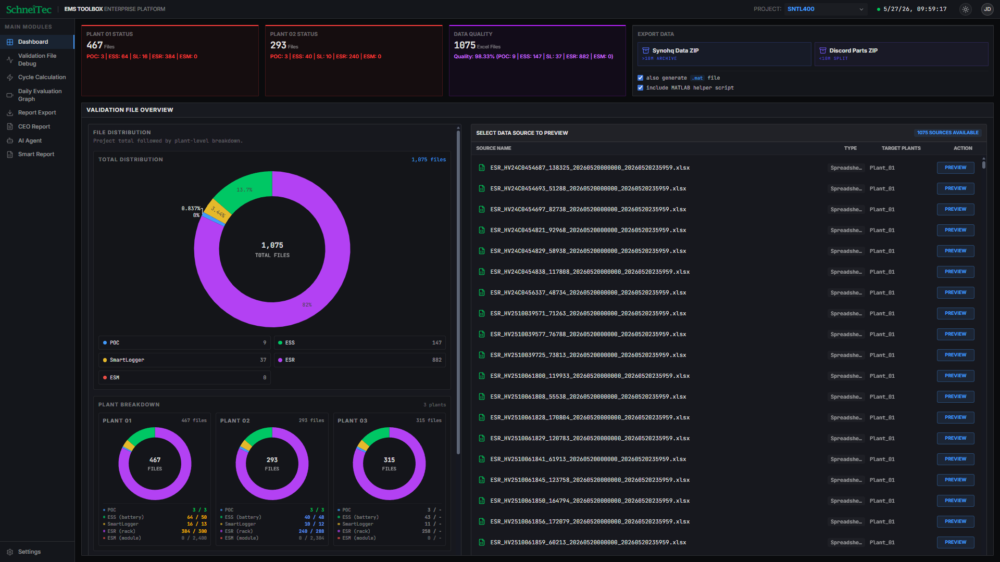

# DATA Visualization in ESS

This project is a standalone React + Vite application for ESS data visualization and analysis.

## Live Demo

🔗 Demo: https://data-visualization-in-ess-v2.vercel.app/

## Requirements

- Node.js 18+
- npm

## Local Setup

1. Install dependencies:
   `npm install`

2. Start the development server:
   `npm run dev`

The app runs on `http://localhost:3000`.

## Available Scripts

- `npm run dev` starts the local Vite dev server
- `npm run build` creates a production build
- `npm run preview` previews the production build locally
- `npm run lint` runs the TypeScript check

## Notes

- This project runs fully locally with React + Vite.
- No Gemini API key or AI Studio setup is required.
